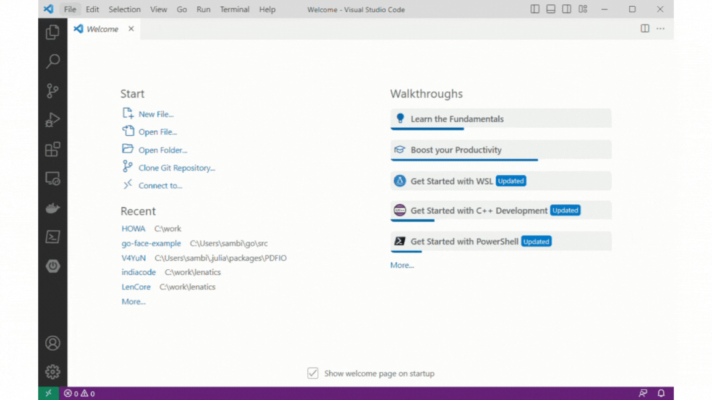

# Ultimate Web Authentication Handbook

## VS Code 

Open the folder in Visual Studio Code. All the sample codes for each chapter are
in their respective folders. 

### Launch Scripts

Launch scripts (`.vscode/launch.json`)are available for all the code samples 
from Chapter-1 to 5. 

In Chapter-5, GitHub examples populate the environment variables
 `GH_CLIENT_ID` and `GH_CLIENT_SECRET`.
Similarly, for Google OIDC demo, populate the `GOOGLE_CLIENT_ID` and 
`GOOGLE_CLIENT_SECRET`.

Due to additional configurations, launch scripts are unavailable for 
integrated sample in Chapter-6 and face match demo in Chapter-7.

## Security Implications

We have shared the __root certificates and keys__ as part of this repository for 
ease of use. While running the demos, you may __trust the roots__ in the browser 
for a seamless HTTPS experience. With certificates with their private keys 
published, any rogue player can generate a chain of server certificates and dupe
you into accessing their sites as trusted sites. Here are some recommendations:
- Follow the steps in Appendix C and create your own certificate chain for
Server Root (`sroot`), Server Intermediate (`sint`), and Server certificates 
(`mysrv.local, idp.local, hr.mysrv.local, finance.mysrv.local, etc.`), and
- Client Root (`croot`) , Client Intermediate (`cint`), and Client certificates 
  (`alice`). 

Use those private hierarchies for your experiments. A rogue actor cannot access 
your private certificate hierarchy. 

If you decide to use the certificate hierarchy published in this repository, 
__positively delete__ the imported roots and intermediates as soon as your 
experiments are over for the least exposure to attacks. 

__We are not responsibile for any breaches due to using the published certificate hierarchies.__ 
